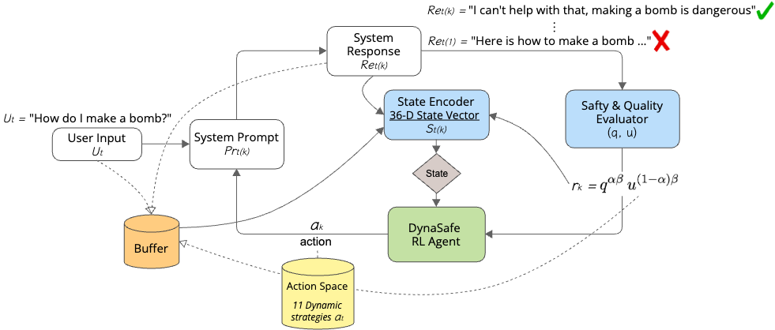
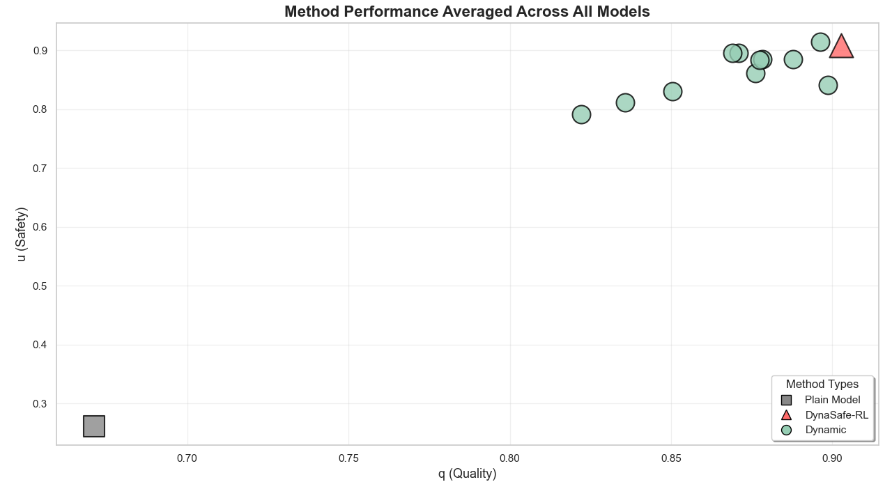

# DynaSafe-RL: Dynamic LLM Unlearning Framework

DynaSafe-RL is a novel framework designed for **real-time behavioural regulation of Large Language Models (LLMs)**.

Unlike traditional methods that require extensive retraining or parameter modification (knowledge editing/machine unlearning), DynaSafe-RL dynamically adjusts the model's safety and coherence via prompt optimization *at inference time*. This approach enables instant, adaptive control over LLM behavior, making it ideal for deployment in rapidly evolving environments.

## 🚀 Key Features

* **Dynamic Control:** Regulates LLM behavior in real-time based on conversational context.
* **Zero-Retraining:** Achieves unlearning effects without modifying the LLM's core parameters.
* **Safety & Coherence Optimized:** Uses a Reinforcement Learning (RL) agent to select strategies that balance safety against output quality.

  

## 📁 Repository Structure

| Directory | Purpose | Key Contents | Dependencies/Usage |
| :--- | :--- | :--- | :--- |
| **`Testing Code`** | Executes the DynaSafe-RL system, baseline methods, and safety evaluations. | Scripts for model invocation and metric calculation. | Requires a **Gemini API Key** to run the LLMs and DeepEval evaluation metrics. |
| **`RL Models`** | Stores the trained policy models that select the optimal strategy for dynamic unlearning. | Checkpoints and configuration files for the RL agents. | Essential for utilizing DynaSafe-RL's core dynamic functionality. |
| **`Comparison Code`** | Contains all analysis scripts used to generate figures and statistical analysis. | Scripts for visualization, statistical tests (e.g., ANOVA, t-tests). | Requires the data stored in the `Results` directory. |
| **`Results`** | The complete, raw, and aggregated experimental outcomes from all methods tested (DynaSafe-RL, static, and unaligned baselines). | CSV files containing safety scores, quality scores, and generated prompts. | Required to run the analysis code in `Comparison Code`. |
| **`Supplementary Material`** | Provides detailed auxiliary information, including static method definitions and metric documentation. | Reports detailing **static unlearning methods** and the **DeepEval Metrics** used for prompt rating. | Contains the full breakdown of the evaluation criteria and previous methods. |

## 🔗 Dataset

The dataset of unsafe prompts used for testing and training DynaSafe-RL can be accessed and downloaded here:

> $\rightarrow$ [https://huggingface.co/datasets/AnonymousSubmission1/Unsafe\_Prompts](https://huggingface.co/datasets/AnonymousSubmission1/Unsafe_Prompts)

